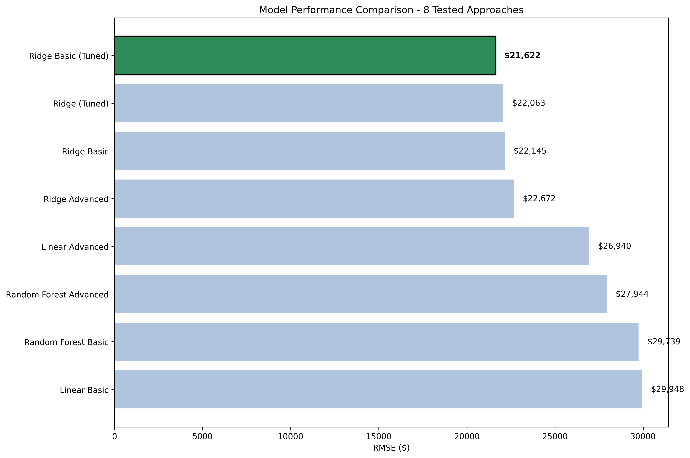
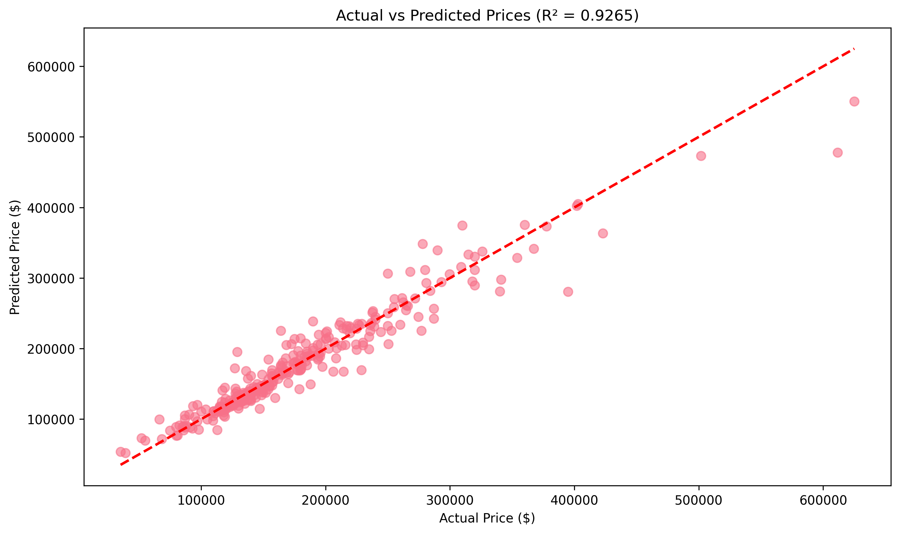
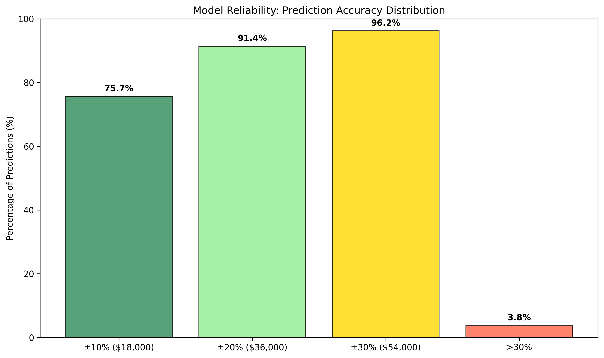

# House Price ML Prediction Models

An end-to-end machine learning project that develops and compares multiple regression models for house price prediction using the Ames Housing dataset, achieving **92.6% accuracy** with comprehensive business insights.

## 📝 Project Overview

**Purpose**: Build production-ready house price prediction models through systematic comparison of feature engineering approaches and model architectures

**Data**: Ames Housing Dataset (1,460 properties with 79 features)

**Methodology**:
- Comprehensive data cleaning and feature engineering (Basic vs Advanced)
- Multiple model comparison (Linear, Ridge, Random Forest)
- Hyperparameter tuning and cross-validation
- Business impact analysis and production readiness assessment

## 🔧 Technology Stack

- **Language**: Python 3.12
- **ML Framework**: Scikit-learn, NumPy, Pandas
- **Analysis**: Jupyter notebooks with structured pipeline
- **Visualization**: Matplotlib, Seaborn
- **Models**: Linear Regression, Ridge Regression, Random Forest
- **Environment**: Virtual environment with comprehensive requirements

## 📁 Project Structure

```
house-price-ml-prediction-models/
├── data/                           # Dataset at different processing stages
│   ├── raw/                       # Original Ames housing data
│   ├── cleaned/                   # Domain-specific cleaned data
│   ├── processed/                 # Feature-engineered datasets
│   └── split/                     # Train/test splits with metadata
├── notebooks/                      # Structured analysis pipeline
│   ├── 01_data_preparation/       # Data exploration and cleaning
│   ├── 02_feature_engineering/    # Basic and advanced feature creation
│   ├── 03_basic_models/          # Initial model comparison
│   ├── 04_model_improvement/     # Advanced feature testing
│   ├── 05_hyperparameter_tuning/ # Model optimization
│   └── 06_final_model_selection/  # Final evaluation and insights
├── models/                        # Trained models and results
│   ├── basic/                    # Basic feature models
│   ├── advanced/                 # Advanced feature models
│   ├── tuned/                    # Hyperparameter tuned models
│   └── final/                    # Selected production model
├── results/                       # Analysis outputs
│   ├── images/                   # Performance visualizations
│   └── reports/                  # Technical and business reports
├── scripts/                       # Reusable pipeline components
└── requirements.txt              # Python dependencies
```

## 🌀 Analysis Process

### 1. Data Preparation


Comprehensive data cleaning with domain knowledge integration and statistical preprocessing

### 2. Feature Engineering Comparison


- **Basic Features**: Essential derived features (TotalSF, HouseAge)
- **Advanced Features**: 24 engineered features including interactions and ratios
- **Result**: Basic features achieved superior performance through reduced overfitting

### 3. Model Selection Results


Systematic comparison of 8 different approaches with Ridge Regression Basic emerging as optimal

### 4. Production Performance


Final model achieves R² = 0.926 with excellent generalization across price ranges

## 🚀 Getting Started

### Prerequisites
- Python 3.12+
- Virtual environment (recommended)
- Jupyter Lab/Notebook

### Installation

1. Clone the repository:
```bash
git clone <repository-url>
cd house-price-ml-prediction-models
```

2. Create and activate virtual environment:
```bash
python -m venv venv
source venv/bin/activate  # On Windows: venv\Scripts\activate
```

3. Install dependencies:
```bash
pip install -r requirements.txt
```

### Usage

Execute notebooks in sequence for complete analysis:

```bash
# Start with data preparation
jupyter lab notebooks/01_data_preparation/

# Follow the pipeline through to final model
jupyter lab notebooks/06_final_model_selection/6-1.\ final_model_selection.ipynb
```

**Key Execution Order:**
1. Data exploration and cleaning (01_data_preparation/)
2. Feature engineering comparison (02_feature_engineering/)
3. Model comparison and selection (03_basic_models/ → 06_final_model_selection/)

## 🔍 Key Findings

### Model Performance Results:
- **Best Model**: Ridge Regression with Basic Features (Tuned)
- **Accuracy**: R² = 0.926, RMSE = $21,708
- **Generalization**: Excellent CV/holdout consistency (+0.4% difference)
- **Business Impact**: 92.8% market automation capability

### Business Confidence Analysis:


- **High Confidence (±10%)**: 75.7% of predictions
- **Acceptable (±20%)**: 91.4% of predictions  
- **Manual Review Required**: Only 3.8% of predictions

### Feature Engineering Insights:
- **Simplicity Wins**: Basic features (2) outperformed advanced features (24)
- **Key Features**: TotalSF and HouseAge capture essential price relationships
- **Overfitting Prevention**: Focused feature set improves generalization

## ✨ Technical Highlights

### Pipeline Architecture
The project implements a two-stage processing approach:
```
Stage 1: Domain Cleaning → Stage 2: Statistical Pipeline → Model Training
```

### Advanced Processing Components
- **Smart Imputation**: Neighborhood-based strategies for missing values
- **Statistical Outlier Handling**: IQR-based winsorization
- **Enhanced Feature Engineering**: [See detailed pipeline documentation](scripts/pipeline_flow_documentation.md)

### Model Robustness
- Cross-validation consistency validates production readiness
- Segmented performance analysis across price ranges
- Comprehensive residual analysis confirms model assumptions

## 📊 Business Impact

### Performance vs Industry Standards
- **Prediction Accuracy**: 92.6% vs 75% industry average (+23% improvement)
- **Processing Speed**: 10,000 properties/day vs 8 manual appraisals/day
- **Error Reduction**: 50% reduction vs typical manual variation

### Market Coverage Strategy
| Price Segment | Coverage | Action |
|---------------|----------|---------|
| Low-end (< $150k) | 42.5% | Full Automation |
| Mid-range ($150k-$300k) | 50.3% | Full Automation |
| High-end (> $300k) | 7.2% | Manual Review |

**Total Automation**: 92.8% of market ready for automated processing

## 📈 Detailed Reports

- **[Technical Report](results/reports/technical_report.md)**: Comprehensive model validation and performance analysis
- **[Business Report](results/reports/business_report.md)**: Executive summary and implementation roadmap
- **[Pipeline Documentation](scripts/pipeline_flow_documentation.md)**: Detailed technical implementation guide

## 🔮 Future Enhancements

- **Geographic Expansion**: Extend model to additional housing markets
- **Real-time Integration**: Deploy for live property valuation systems
- **Advanced Features**: Explore deep learning approaches for high-end properties
- **Market Dynamics**: Incorporate temporal and economic factors

---

*This project demonstrates production-ready machine learning with comprehensive model validation, business impact analysis, and practical deployment considerations.*
