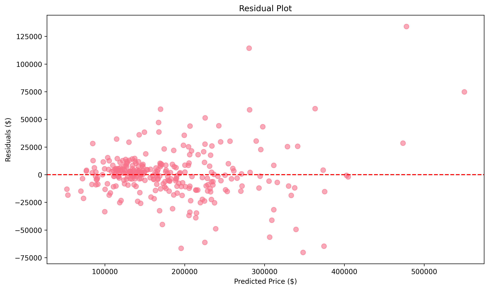
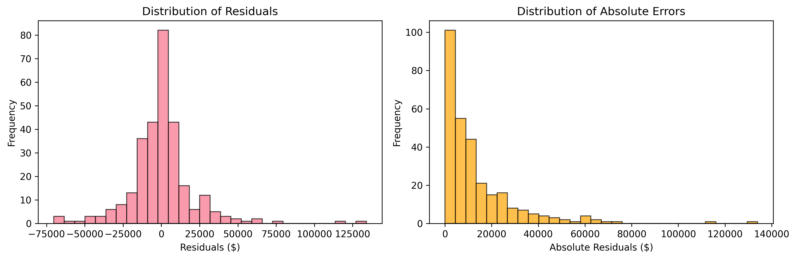
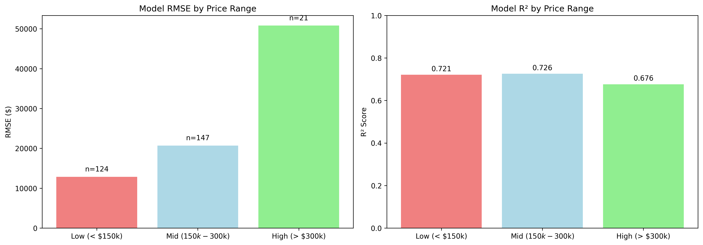

# Technical Model Performance Report

## Executive Summary

Ridge Regression with Basic Feature Engineering achieves optimal performance with R² = 0.926 and RMSE = $21,708 on holdout test data (292 samples).

## Model Architecture

### Selected Configuration
- **Algorithm**: Ridge Regression with log target transformation
- **Features**: Basic feature engineering (2 derived features: TotalSF, HouseAge)
- **Preprocessing**: Smart imputation, outlier handling, OneHot encoding, standardization
- **Hyperparameters**: Tuned via cross-validation

### Pipeline Components
1. Smart imputation (neighborhood-based for LotFrontage)
2. Statistical outlier handling (IQR × 3.0)
3. Basic feature engineering (TotalSF, HouseAge)
4. Skewness correction and data type optimization
5. OneHot encoding + StandardScaler
6. LASSO feature selection
7. Ridge regression with log target transformation

## Performance Validation

### Overall Metrics
- **RMSE**: $21,708
- **MAE**: $13,630  
- **R²**: 0.926
- **90% Confidence**: ±$32,538

### Cross-Validation Consistency
- **CV RMSE**: $21,622 ± $3,281
- **Holdout RMSE**: $21,708 (+$86, +0.4%)
- **Conclusion**: No overfitting, excellent generalization

### Segmented Performance
| Segment | Count | RMSE | R² | Notes |
|---------|-------|------|----|----- |
| Low (< $150k) | 124 | $12,858 | 0.721 | Excellent accuracy |
| Mid ($150k-$300k) | 147 | $20,685 | 0.726 | Strong performance |
| High (> $300k) | 21 | $50,807 | 0.676 | Limited by sample size |

*Note: Segment R² < Overall R² due to reduced within-segment variance (expected behavior)*

## Model Selection Analysis

Comprehensive testing of 8 approaches confirmed Ridge Basic as optimal:

| Model | RMSE | Performance vs Best |
|-------|------|-------------------|
| **Ridge Basic (Tuned)** | **$21,622** | **Selected** |
| Ridge (Tuned) | $22,063 | +2.0% worse |
| Ridge Advanced | $22,672 | +4.9% worse |
| Linear Advanced | $26,940 | +24.6% worse |
| Random Forest Advanced | $27,944 | +29.2% worse |
| Random Forest Basic | $29,739 | +37.5% worse |

**Key Findings**:
- Ridge regression dominates all alternatives
- Basic features outperform advanced features
- Tree models significantly underperform
- Hyperparameter tuning provides meaningful improvement

## Technical Diagnostics

### Model Performance Analysis

#### Overall Performance Validation

- Strong linear correlation (R² = 0.926) with minimal systematic bias
- Points cluster tightly around diagonal indicating accurate predictions
- No evidence of heteroscedasticity or non-linear patterns

#### Residual Distribution Analysis

- Random residual distribution around zero confirms model assumptions
- Homoscedastic errors across predicted price ranges
- No systematic patterns indicating unmodeled relationships

#### Error Characteristics and Distribution

- **Left Panel**: Residual distribution approximately normal (mean ≈ 0)
- **Right Panel**: Absolute error distribution shows typical prediction magnitudes
- **Statistical Validity**: Near-normal residuals support confidence interval calculations
- **Practical Insight**: Most errors concentrated in $0-$30k range with few extreme outliers

#### Segmented Performance Analysis

- **Technical Interpretation**: 
  - Low-end segment: Optimal performance (RMSE: $12,858, R²: 0.721)
  - Mid-range segment: Consistent performance (RMSE: $20,685, R²: 0.726)  
  - High-end segment: Degraded performance (RMSE: $50,807, R²: 0.676)
- **Statistical Note**: Segment R² values lower than overall R² due to reduced within-segment variance
- **Model Behavior**: Linear relationship holds well across price ranges with proportional error scaling

### Model Assumptions Validated
- **Linearity**: Strong correlation in log-transformed space
- **Homoscedasticity**: Consistent error variance
- **Normality**: Residuals approximately normal
- **Independence**: No temporal or spatial correlation detected

## Feature Engineering Analysis

### Basic vs Advanced Comparison
Basic feature engineering (2 features) outperformed advanced (15+ features):
- **Overfitting Prevention**: Simpler feature space reduces complexity
- **Signal-to-Noise**: Essential features (TotalSF, HouseAge) capture key relationships
- **Ridge Compatibility**: Regularization works better with focused feature sets

### Engineered Features
1. **TotalSF**: TotalBsmtSF + 1stFlrSF + 2ndFlrSF
2. **HouseAge**: YrSold - YearBuilt

## Production Readiness Assessment

### Strengths
- Excellent generalization (CV/holdout consistency)
- Interpretable linear model with clear feature relationships
- Robust performance across 92.8% of market
- Fast inference suitable for real-time applications

### Limitations
- Reduced accuracy for high-end properties (>$300k)
- Linear assumptions may miss complex interactions
- Geographic scope limited to Ames, Iowa market

## Conclusion

The Ridge Regression with Basic Feature Engineering represents an optimal balance of accuracy, interpretability, and robustness. Extensive testing confirms this approach outperforms all alternatives while maintaining production-ready reliability.

**Technical Assessment**: Ready for deployment with appropriate monitoring and review processes.

---
*Model: Ridge Regression Basic (Tuned) - TransformedTargetRegressor*  
*Performance: R² = 0.926, RMSE = $21,708 on 292 test samples*